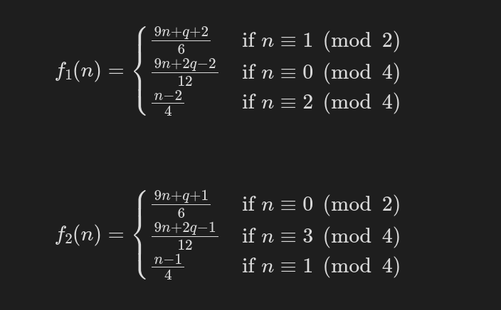

# collatz-divisibility-test

## Overview

This is a divisibility test based on the dynamics of the generalized Collatz $3n + q$ variant function.

It utilizes two frameworks (maps):

The function $f_{1}$ is used when $q \equiv 1 \pmod{6}$

And the function $f_{2}$ is used when $q \equiv 5 \pmod{6}$

### Pros

- It uses only addition, shifting, and bitwise AND for checking.
- If $a$ is divisible by $b$, it can provide the answer very quickly as a result of that.

### Cons

- Memory consumption.
